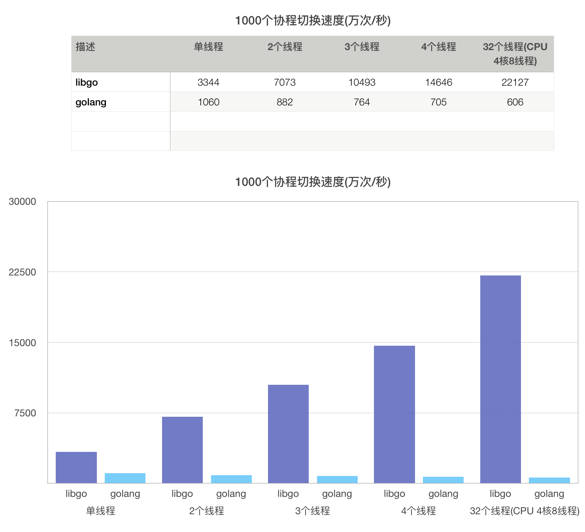

# libgo

### libgo -- a coroutine library and a parallel Programming Library

Libgo is a stackful coroutine library for collaborative scheduling written in C++ 11, and it is also a powerful and easy-to-use parallel programming library.

Three platforms are currently supported:

    Linux

    MacOSX
    
    Windows (Win7 or above,x86 or x64,complie with VS2015/2017)

Using libgo to write multi-threaded programs, it can be developed as fast and logical as golang and Erlang concurrent languages, and has the performance advantages of C++ native.It make it happen that one can serve God and Mammon.

Libgo has the following characteristics:

*   1.Provide golang's General powerful protocol, write code based on coroutine, can write simple code in a synchronous manner, while achieving asynchronous performance.

*   2.Supporting massive coroutines, creating 1 million coroutines requires only 4.5 GB of physical memory. (data from real test, in no deliberately compressed stack situation.)

*   3.Supporting multi-threaded scheduling protocols, providing efficient load balancing strategy and synchronization mechanism, it is easy to write efficient multi-threaded programs.

*   4.The number of scheduled threads supports dynamic scaling, and there is no head blocking caused by slow scheduling.

*   5.Use hook technology to make synchronous third-party libraries of linking processes become asynchronous calls, which greatly improves their performance. There's no need to worry that some DB authorities don't provide asynchronous drivers, such as hiredis and mysqlclient, which are client drivers that can be used directly and can achieve performance comparable to that of asynchronous drivers.

*   6.Both dynamic links and full static links are supported, which makes it easy to generate executable files using C++ 11 static links and deploy them to low-level Linux systems.

*   7.Provide Channel, Co_mutex, Co_rwmutex, timer and other features to help users write programs more easily.

*   8.Supports local variables (CLS) of the process, and completely covers all scenarios of TLS (read the tutorial code sample13_cls.cpp for details).

* From user feedback in the past two years, many developers have a project with an asynchronous non-blocking model (probably based on epoll, libuv or ASIO network libraries) and then need access to DBs such as MySQL that do not provide asynchronous driver. Conventional connection pool and thread pool schemes are intensive in high concurrency scenarios (each connection have to correspond to a thread for Best performance. Thousands of instruction cycles of thread context switching  are intensive and too many active threads will lead to a sharp decline performance in OS scheduling capacity, which is unacceptable to many develops.

* In this situation, there is no need to reconstruct the existing code if we want to use libgo to solve the problem of blocking operation in non-blocking model. The new libgo 3.0 has created three special tools for this scenario, which can solve this problem without intrusion: multi-scheduler with isolated running environment and easy interaction (read the tutorial code sample1_go.cpp for details), libggo can instead of the traditional thread pool scheme. (read tutorial code sample10_co_pool.cpp and sample11_connection_pool.cpp for details)

* ** tutorial directory contains many tutorial codes, including detailed instructions, so that develop can learn libgo library step by step. **

* If you find any bugs, good suggestions, or use ambiguities, you can submit a issue or contact the author directly:
Email: 289633152@qq.com

 
### compile and use libgo :

 *    Vcpkg:

        
If you have installed vcpkg, you can install it directly using vcpkg:
      $ vcpkg install libgo

 *    Linux: 

        1.Use cmake to compile and install：

            $ mkdir build
            $ cd build
            $ cmake ..
	    $ make debug     #Skip it if you don`t want a debuggable versions.
            $ sudo make uninstall
            $ sudo make install

 
        2.Dynamic link to glibc: (put libgo at the front of link list)
        
            g++ -std=c++11 test.cpp -llibgo -ldl [-lother_libs]
            
        3.Full static link: (put libgo at the front of link list)

            g++ -std=c++11 test.cpp -llibgo -Wl,--whole-archive -lstatic_hook -lc -lpthread -Wl,--no-whole-archive [-lother_libs] -static

 *    Windows: (3.0 is compatible with windows, just use master branch directly!)
 
        0.When using GitHub to download code on windows, we must pay attention to the problem of newline characters. Please install git correctly (using default options) and use git clone to download source code. (Do not download compressed packages)
 
        1.Use CMake to build project. 
			
			#For example vs2015(x64)：
			$ cmake .. -G"Visual Studio 14 2015 Win64"

			#For example vs2015(x86)：
			$ cmake .. -G"Visual Studio 14 2015"
        
        2.If you want to execute the test code, please link the boost library. And set BOOST_ROOT in the cmake parameter:
        
        		For example：
        		$ cmake .. -G"Visual Studio 14 2015 Win64" -DBOOST_ROOT="e:\\boost_1_69_0"

### performance

Like golang, libgo implements a complete scheduler (users only need to create a coroutine without concern for the execution, suspension and resource recovery of the coroutine). Therefore, libgo is qualified to compare the performance of single-threaded with golang (It is not qualified to do performance comparison in different ability).

Test environment: 
2018 13-inch MAC notebook (CPU minimum)
Operating System: Mac OSX
CPU: 2.3 GHz Intel Core i5 (4 Core 8 Threads)
Test script: $test/golang/test.sh thread_number

### Matters needing attention(WARNING)：
 
TLS or non-reentrant library functions that depend on TLS implementation should be avoided as far as possible.
If it is unavoidable to use, we should pay attention to stop accessing the TLS data generated before handover after the process handover.

### There are several kinds of behaviors that may cause the process switching:

* The user calls co_yield to actively give up the cpu span.
* Competitive Cooperative Lock, Channel Reading and Writing.
* System Call of Sleep Series.
* System calls waiting for events to trigger, such as poll, select, epoll_wait.
* DNS-related system calls (gethostbyname series).
* Connect, accept, data read-write operations on blocking sockets.
* Data Read-Write Operation on Pipe.

### System Call List of Hook on Linux System:

		connect   
		read      
		readv     
		recv      
		recvfrom  
		recvmsg   
		write     
		writev    
		send      
		sendto    
		sendmsg   
		poll      
		__poll
		select    
		accept    
		sleep     
		usleep    
		nanosleep
		gethostbyname                                                               
		gethostbyname2                                                              
		gethostbyname_r                                                             
		gethostbyname2_r                                                            
		gethostbyaddr                                                               
		gethostbyaddr_r

	The above system calls are all possible blocking system calls. The whole thread is no longer blocked in the process. During the blocking waiting period, the CPU can switch to other processes to execute.System calls executed in native threads by HOOK are 100% consistent with the behavior of the original system calls without any change.
  
		socket
		socketpair
		pipe
		pipe2
		close     
		__close
		fcntl     
		ioctl     
		getsockopt
		setsockopt
		dup       
		dup2      
		dup3      

    The above system calls will not cause blocking, although they are also Hook, but will not completely change their behavior, only for tracking socket options and status.

### System Call List of Hook on Windows System:

		ioctlsocket                                                                        
		WSAIoctl                                                                           
		select                                                                             
		connect                                                                            
		WSAConnect                                                                         
		accept                                                                             
		WSAAccept                                                                          
		WSARecv                                                                            
		recv                                                                               
		recvfrom                                                                           
		WSARecvFrom                                                                        
		WSARecvMsg                                                                         
		WSASend                                                                            
		send                                                                               
		sendto                                                                             
		WSASendTo                                                                          
		WSASendMsg
